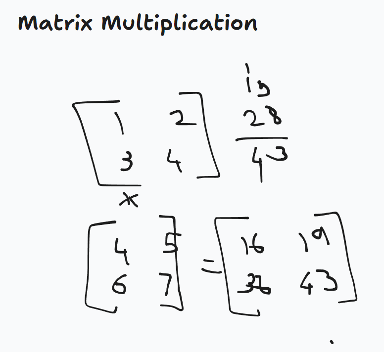
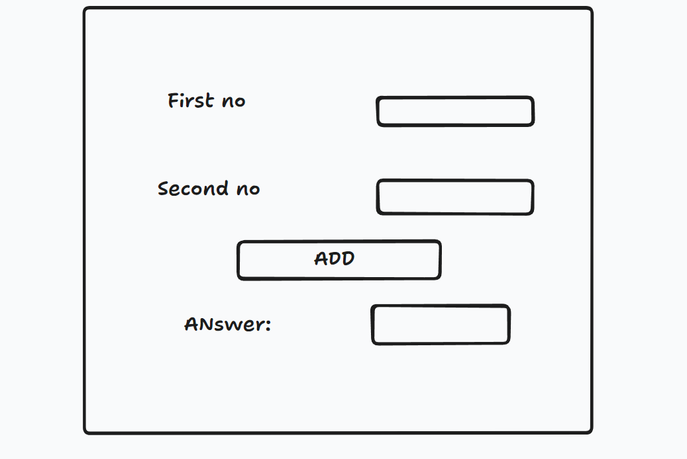

# What is 'this' keyword used for

The 'this' keyword is used to refer to the current object. It is used in the context of object-oriented programming (OOP) to refer to the current instance of the class.

# What is 'super' keyword used for

The 'super' keyword is used to refer to the parent class of the current class. It is used in the context of object-oriented programming (OOP) to refer to the parent class of the current instance of the class.

# what is method overriding

Method overriding is a feature of Java that allows a child class to provide a different implementation of a method that is already defined in its parent class. Here the child class overrides the method of the parent class.

# what is constructor overloading

Constructor overloading is a feature of Java that allows a class to have multiple constructors with the same name but different parameters. This allows the class to be created with different sets of arguments, each with their own unique behavior.

# what is polymorphism in java

Polymorphism means many behaviour. There are two times of polymorphism runtime polymorphism and compilt time polymorphism. Runtime polymorphism is when the behaviour of an object is determined at runtime based on the type of the object(Method Overriding). Compile time polymorphism is when the behaviour of an object is determined at compile time based on the type of the object.(Method Overloading).

# What is the difference between throw and throws

The 'throw' keyword is used to throw an exception. It is used to indicate that an exception has been thrown and that the program should be terminated.

The 'throws' keyword is used to indicate that a method can throw an exception. It is used to specify that a method can throw an exception and that the method signature must include the 'throws' keyword.

# What is thread priority

In Java, every thread has a priority, which is an integer value that influences the order in which threads are scheduled for execution. The higher the priority value, the more likely it is that the thread will be given preference by the operating system's thread scheduler.   

Here's a breakdown of thread priority:

Priority Values

Range: Thread priority values range from 1 (lowest) to 10 (highest).   
Constants: The Thread class defines three constants for priority:
MIN_PRIORITY (1)
NORM_PRIORITY (5) - the default priority for new threads
MAX_PRIORITY (10)
How it Works
a
The thread scheduler uses priority as a guideline to determine which thread should run next. However, it's important to note that thread scheduling is complex and depends on many factors, including the operating system and the current load.   

Setting Priority

You can set a thread's priority using the setPriority() method

# How to split a file containing string of integers

String s[] = br.readLine().split("\\s+");

## Matrix Multiplication

## GUI Addition
